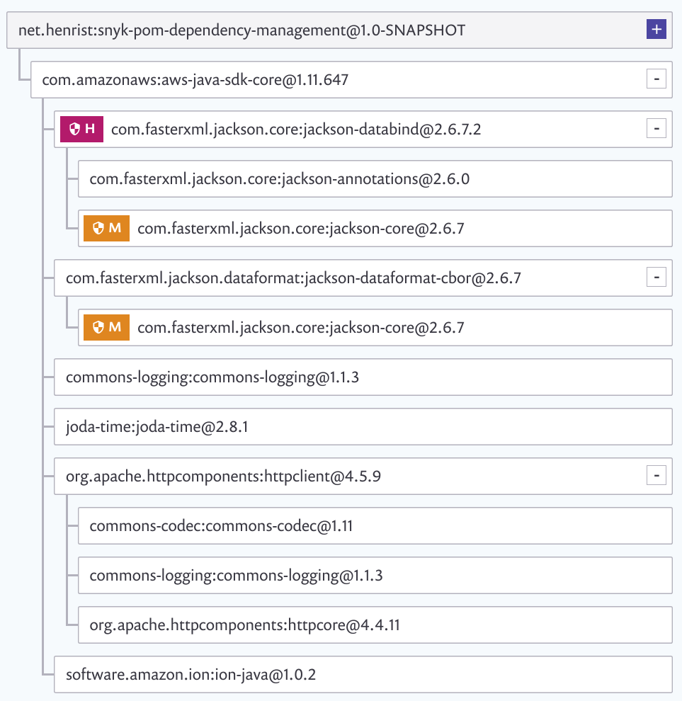

# snyk-pom-dependency-management

[](https://snyk.io/test/github/henrist/snyk-pom-dependency-management)

This repository is used to show the issue with Snyk
automated tests not reading version overrides through
`<dependencyManagement>` in `pom.xml`.

## Workaround: Don't use BOM

Official Snyk support reponse (my ticket #2007) as of 2019-10-17:

> Thanks for putting this scenario to our attention! Looks like
> this is a missing feature that we do not have support for BOMs in
> dependencyManagement via SCM tests. I have added a ticket to our
> backlog for this.
>
> In the meanwhile, you will need to directly manage the dependencies
> in order to see the expected result when importing your project from SCM.

## Output from `mvn dependency:tree`

(This is from before the workaround was applied.)

As can be seen from this, only Jackson 2.10.0 is included.
However, Snyk does not detect this, and reports the application
wrongly vulnerable as can be seen in the Snyk report.

```text
[INFO] Scanning for projects...
[INFO]
[INFO] -------------< net.henrist:snyk-pom-dependency-management >-------------
[INFO] Building snyk-dependency-management 1.0-SNAPSHOT
[INFO] --------------------------------[ jar ]---------------------------------
[INFO]
[INFO] --- maven-dependency-plugin:2.8:tree (default-cli) @ snyk-pom-dependency-management ---
[INFO] net.henrist:snyk-pom-dependency-management:jar:1.0-SNAPSHOT
[INFO] \- com.amazonaws:aws-java-sdk-core:jar:1.11.647:compile
[INFO]    +- commons-logging:commons-logging:jar:1.1.3:compile
[INFO]    +- org.apache.httpcomponents:httpclient:jar:4.5.9:compile
[INFO]    |  +- org.apache.httpcomponents:httpcore:jar:4.4.11:compile
[INFO]    |  \- commons-codec:commons-codec:jar:1.11:compile
[INFO]    +- software.amazon.ion:ion-java:jar:1.0.2:compile
[INFO]    +- com.fasterxml.jackson.core:jackson-databind:jar:2.10.0:compile
[INFO]    |  +- com.fasterxml.jackson.core:jackson-annotations:jar:2.10.0:compile
[INFO]    |  \- com.fasterxml.jackson.core:jackson-core:jar:2.10.0:compile
[INFO]    +- com.fasterxml.jackson.dataformat:jackson-dataformat-cbor:jar:2.10.0:compile
[INFO]    \- joda-time:joda-time:jar:2.8.1:compile
[INFO] ------------------------------------------------------------------------
[INFO] BUILD SUCCESS
[INFO] ------------------------------------------------------------------------
[INFO] Total time:  1.006 s
[INFO] Finished at: 2019-10-09T21:58:59+02:00
[INFO] ------------------------------------------------------------------------
```

## Output from Snyk CLI

(This is from before the workaround was applied.)

It appears the Snyk CLI reports this correctly.

```bash
snyk test
```

```text
✓ Tested 11 dependencies for known issues, no vulnerable paths found.
```

```bash
snyk test --print-deps
```

```text
net.henrist:snyk-pom-dependency-management @ 1.0-SNAPSHOT
   └─ com.amazonaws:aws-java-sdk-core @ 1.11.647
      ├─ commons-logging:commons-logging @ 1.1.3
      ├─ org.apache.httpcomponents:httpclient @ 4.5.9
      │  ├─ org.apache.httpcomponents:httpcore @ 4.4.11
      │  └─ commons-codec:commons-codec @ 1.11
      ├─ software.amazon.ion:ion-java @ 1.0.2
      ├─ com.fasterxml.jackson.core:jackson-databind @ 2.10.0
      │  ├─ com.fasterxml.jackson.core:jackson-annotations @ 2.10.0
      │  └─ com.fasterxml.jackson.core:jackson-core @ 2.10.0
      ├─ com.fasterxml.jackson.dataformat:jackson-dataformat-cbor @ 2.10.0
      └─ joda-time:joda-time @ 2.8.1
```

## Image from Snyk UI

(This is from before the workaround was applied.)


